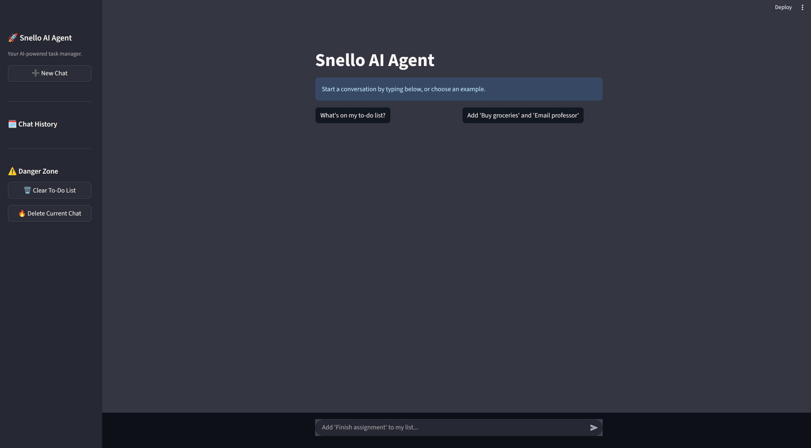

# Snello SDE Intern - To-Do List Agent

This repository contains the take-home assignment for the Snello SDE Internship. It is a complete, conversational AI application that acts as a personal to-do list manager, featuring a full web interface and persistent, multi-session memory.


## 🌐 WEBSITE USER INTERFACE OVERVIEW



> **This image displays the main Snello Web Application page.** It features:
>
> - A rich and responsive Streamlit-based chat interface
> - A sidebar for real-time session history
> - A dynamic to-do list dashboard
> - Full control options including chat/session deletion and task clearing

This clean and professional layout mimics modern production-grade AI interfaces.


## 🚀 Project Highlights & Key Features

I aimed to not only meet the requirements but to build a robust, user-friendly application that reflects real-world product standards.

- **Interactive Web UI:** A polished and responsive user interface built with Streamlit, providing a professional chat experience far beyond a simple CLI.
- **Multi-Session Chat History:** Every new chat is automatically saved as a separate session. Users can browse, load, and continue any past conversation from the sidebar, just like in modern AI chat applications.
- **AI-Generated Chat Titles:** To make history easy to navigate, new chat sessions are automatically given a short, relevant title generated by the LLM based on the conversation's topic.
- **Live To-Do List Dashboard:** A real-time view of the current to-do list is always visible in the sidebar, updating instantly after every action, providing constant context to the user.
- **Full Session & Data Control:** The UI includes "Danger Zone" controls to instantly clear the entire to-do list or delete specific chat sessions, giving the user full control over their data.
- **Advanced Agentic Architecture:** The agent uses a ReAct (Reason+Act) framework orchestrated with LangGraph, enabling it to intelligently decide when to use tools to fulfill requests.
- **Robust Backend:** Features persistent storage via SQLite, a clean separation of concerns, and graceful error handling for common issues like API rate limits.

## 🧠 Architecture & Design

This application is designed with a clean separation between the backend agent logic and the frontend user interface.

**Backend (agent.py, tools.py, database.py):** Contains the core agent logic, tool definitions, and database interactions. It is a self-contained module that exposes the agent's functionality.

**Frontend (app.py, main.py):** Provides two interfaces to interact with the agent:

- **app.py:** The primary, rich web application using Streamlit.
- **main.py:** A simple command-line interface (CLI) for basic testing or headless operation.


## 🛠 Tech Stack

| Layer         | Technology           | Purpose                                      |
|---------------|----------------------|----------------------------------------------|
| Language      | Python               | Core application logic.                      |
| Web UI        | Streamlit            | Creating the interactive user interface.     |
| Orchestration | LangGraph & LangChain| Building the agent's reasoning and tool-use flow. |
| LLM           | Google Gemini 1.5 Flash | Powering the conversational and reasoning abilities. |
| Database      | SQLite               | Persistent storage for the to-do list.       |
| Memory        | File-based JSON      | Storing and managing multi-session chat histories. |

## 📦 Setup and Run Instructions

This project is fully self-contained. Follow these steps to get it running in minutes.

### 1. Clone the Repository
```bash
git clone https://github.com/ChakradharReddy3237/Snello-agent-assignment.git
cd Snello-agent-assignment
```

### 2. Create and Activate Virtual Environment
```bash
python3 -m venv venv
source venv/bin/activate
```

### 3. Install Dependencies
All required packages are listed in requirements.txt.
```bash
pip install -r requirements.txt
```

### 4. Set Up API Key
Create a file named `.env` in the root project directory.

Add your Google API Key to this file. The `.gitignore` file is configured to keep this file private.
```bash
GOOGLE_API_KEY="AIzaSy...your...key...here"
```

### 5. Run the Application
The primary way to experience this project is through the Streamlit web interface.
```bash
streamlit run app.py
```
This will automatically open the application in your web browser.

## 🧠 Advanced Memory System

The agent features a robust, multi-session memory system designed for a seamless user experience.

- **To-Do List Memory:** Stored in a single `todo.db` SQLite file. This centralized database ensures the task list is always persistent and up-to-date across all chat sessions.

- **Conversation Memory:** Managed in a dedicated `chat_histories/` directory.

  - **Session Files:** Each new chat is saved as a separate JSON file, named with a unique timestamp (e.g., `20240715_103000.json`).
  
  - **Rich Metadata:** Each file stores not just the messages, but also the session ID, an AI-generated title, and the creation date.

The sidebar automatically scans this directory to build the interactive history panel.

## ⚠️ Limitations & Future Improvements

- **API Rate Limits:** The app uses Google's free tier, which has a daily request limit. I have implemented graceful error handling in the UI to inform the user if this limit is reached. For a production environment, this would be resolved by enabling billing on the Google Cloud project.

- **No Response Streaming:** Responses currently appear only after the full agent chain has completed. A key future improvement would be to implement response streaming to display the text token-by-token, significantly improving the perceived responsiveness of the chat.

- **Simplified Error Handling:** While rate limits are handled, the general try...except block could be more specific to different types of API or tool execution errors.

🧠 Built for Snello | ✨ Powered by LangGraph, Gemini & Python
