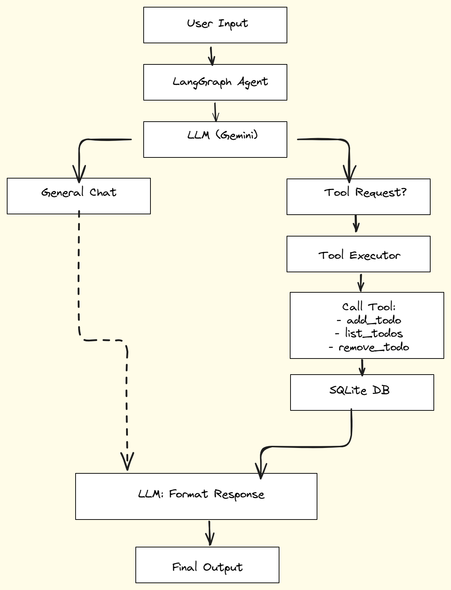

# Snello SDE Intern - To-Do List Agent

This repository contains the take-home assignment for the Snello SDE Internship. It features a conversational AI agent built with LangGraph and Google's Gemini API that can manage a personal to-do list.

## 🚀 Features

- **Conversational Chat:** Holds a natural conversation using Google's Gemini model.
- **Tool-Enabled:** Can understand user requests to add, list, or remove items from a to-do list.
- **Persistent To-Do List:** The to-do list is stored in a local SQLite database, so it persists between sessions.
- **Persistent Conversation Memory:** The agent remembers past conversations by saving the history to a local JSON file.
- **Robust Error Handling:** Gracefully handles requests to remove non-existent items.

## 🧠 Architecture & Design

The agent uses a **ReAct (Reason + Act)** architecture with LangGraph orchestration. This allows the LLM to reason about user input, decide whether to invoke a tool, call it, and then format the final response.

  
_(Update this path with your actual uploaded diagram in the repo)_

### 🔄 Flow Overview
1. **User Input** → Text entered by user.
2. **LangGraph Agent** → Routes input to Gemini or tool logic.
3. **LLM Reasoning** → Decides whether it's general chat or tool invocation.
4. **Routing Decision**:
   - Simple query → Respond directly
   - Tool needed → Call tool node (e.g., `add_todo`, `list_todos`, `remove_todo`)
5. **Tool Executor** → Invokes appropriate Python function
6. **SQLite DB** → Modifies or reads from persistent storage
7. **LLM Output** → Formats tool output into natural language
8. **Final Reply** → Shown to the user

## 🛠 Tech Stack

- **Language:** Python
- **Orchestration:** LangGraph & LangChain
- **LLM:** Google Gemini 1.5 Flash
- **Database:** SQLite
- **Tools:** LangChain Tools & Pydantic for input validation

## 📦 Setup and Run Instructions

### 1. Clone the repository
```bash
git clone https://github.com/ChakradharReddy3237/Snello-agent-assignment.git
cd Snello-agent-assignment
```

### 2. Create and activate a virtual environment
```bash
python3 -m venv venv
source venv/bin/activate
```

### 3. Install dependencies
```bash
pip install -r requirements.txt
```

### 4. Add your API key
1. Create a `.env` file in the root directory
2. Add:
```env
GOOGLE_API_KEY="AIzaSy...your...key...here"
```

### 5. Run the app
```bash
python3 main.py
```
🗨️ The agent will be ready to chat in your terminal. Type `exit` to quit.

---

## 🧠 Memory Structure

### 1. To-Do List (Persistent)
- The to-do list itself is stored in a todo.db SQLite file. This ensures that the list is saved even after the program is closed.


### 2. Conversation History (Persistent)
- The chat history is saved to conversation_history.json after every turn. When the application restarts, it loads this file to remember the context of previous conversations.

---

## 🧰 Tool Definitions

Tools are defined in `tools.py` using LangChain's `@tool` decorator and `Pydantic` input schemas.

### 🔨 Example: `remove_todo`
```python
class RemoveTodoInput(BaseModel):
    item_id: int = Field(description="The numerical ID of the to-do item that should be removed.")

@tool(args_schema=RemoveTodoInput)
def remove_todo(item_id: int) -> str:
    """Use this tool to remove a specific item from the to-do list using its ID."""
    was_deleted = database.remove_item(item_id)
    if was_deleted:
        return f"Successfully removed to-do item with ID {item_id}."
    else:
        return f"Error: No to-do item found with ID {item_id}. Please check the ID and try again."
```

---

## ⚠️ Limitations & Future Improvements

- **Latency:** The agent's response can sometimes be slow due to the multiple network calls required by its ReAct architecture. A future improvement could involve implementing response streaming to improve the perceived speed.


- **Database IDs:** The SQLite database uses AUTOINCREMENT for primary keys. This means even after deleting all items, new items will continue from the last highest ID. This is standard database behavior for ensuring unique IDs but could be clarified to the user in the UI.

-   **API Rate Limits:** The application uses the free tier of the Google Gemini API, which is limited to 50 requests per day. During heavy testing or usage, this quota can be exhausted, which will cause the application to temporarily stop responding. The app includes error handling to gracefully inform the user when this occurs. For a production environment, this would be resolved by enabling billing on the Google Cloud project to move to a pay-as-you-go model with much higher limits.

---

🧠 Built for Snello | ✨ Powered by LangGraph, Gemini & Python
